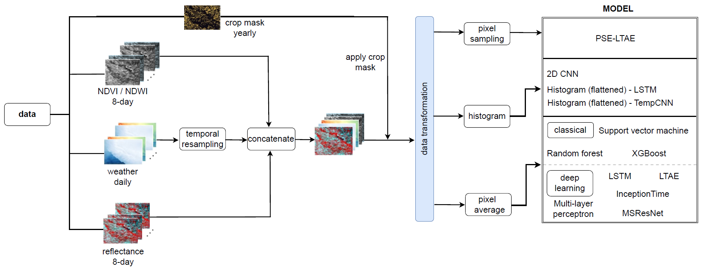

# On exploring spatio-temporal encoding strategies for county-level yield prediction.

Crop yield information plays a pivotal role in ensuring food security. Advances in Earth Observation technology and the availability of historical yield records have promoted the use of machine learning for yield prediction. Significant research efforts have been made in this direction, encompassing varying choices of yield determinants and particularly how spatial and temporal information are encoded. However, these efforts are often conducted under diverse experimental setups, complicating their inter-comparisons. In this paper, we present our findings on multiple strategies for encoding spatial-spectral information at the county level—specifically through average pixel values, pixel sampling, and image histograms alongside approaches for temporal information, including recurrent neural networks, temporal convolutions, and attention mechanisms.

## Study area
The United States of America (USA) is the world’s largest producer of corn, accounting for approximately one-third of global production. We conduct a case study focusing on the USA’s top five corn-producing states: Iowa, Illinois, Indiana, Nebraska, and Minnesota.  Altogether, they accounted for over one-half of the USA’s corn(grain) production in 2021.
<figure>
  
  <figcaption>Fig.1 : Map of the study area showing the difference in corn yield for 2012(drought) and 2011 (predrought) </figcaption>
</figure>

## Data
The effectiveness of machine learning for crop yield prediction also depends on selecting the appropriate sets of features. We review selected studies that apply machine learning (ML) to remote sensing data for
predicting crop yields to determine our predictors. The figure below shows that the selected features adequately captures variations in yield. 
- MODIS surface reflectance (MODIS 
- Meterological factors (temperature and precipitation)
- Spectral indices (NDVI and NDWI)

<figure>
  
  <figcaption>Fig.2: Temporal variability in spectral reflectance, weather variables, and spectral indices for a pre-drought year (2011 -blue) and drought year (2012 - red) for a selected county in Nebraska. </figcaption>
</figure>

## Experiment setup
The workflow follows the compression or transformation of spatio-temporal information into other data structures.
Depending on the type of structure, a befitting machine learning model is applied.
<figure>
  
  <figcaption>Fig.3: Demonstrating the data preparation workflow and experiment setup </figcaption>
</figure>

## Results
The figure presents the percentage difference between observed and predicted crop yield for year 2021.
Interested readers are encouraged to consult the main paper for additional evaluation metrics for the extensive list of models compared.
<figure>
  
  <figcaption>Fig.4: Demonstrating the data preparation workflow and experiment setup </figcaption>
</figure>

## Acknowledgement
Model implementations from this work are sourced from:
- [Breizhcrop](https://github.com/MarcCoru/BreizhCrops)
- [PyCrop](https://github.com/gabrieltseng/pycrop-yield-prediction)
